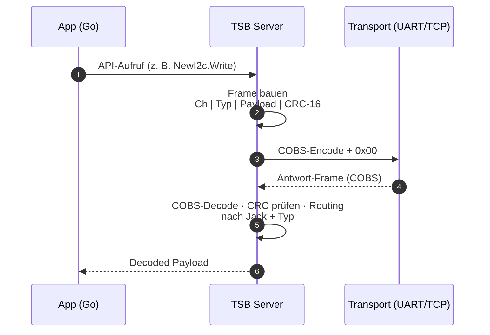
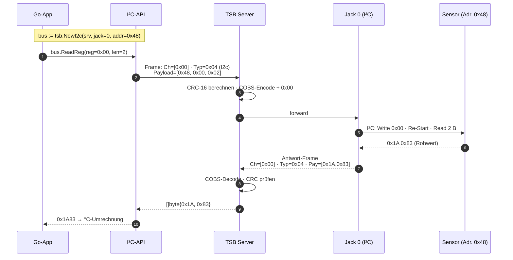

																																												
# TSB – Tiny Serial Bus · Architektur

> `github.com/traulfs/tsb` · Go ≥ 1.20
> **Limits**: MaxJacks = 8 · MaxTyp = 127 · MaxPayload = 250 B · Buflen = 1000 B
>
> **Status**: Redesign der [[TSB - Architektur.excalidraw|Excalidraw-Grafik]] ist umgesetzt (siehe Checkliste unten). Diese Notiz dient als Begleit-Dokumentation und Quick-Reference.

---

## 1 · Gesamtüberblick (Mermaid)

```mermaid
flowchart TB
    classDef api      fill:#E8F1FF,stroke:#2563EB,stroke-width:1.5px,color:#0B1F4D
    classDef server   fill:#FFF7E6,stroke:#D97706,stroke-width:1.5px,color:#3F2A00
    classDef packet   fill:#ECFDF5,stroke:#059669,stroke-width:1.5px,color:#053E2C
    classDef trans    fill:#FDF2F8,stroke:#BE185D,stroke-width:1.5px,color:#3F0420
    classDef free     fill:#F3F4F6,stroke:#9CA3AF,stroke-dasharray:4 3,color:#4B5563
    classDef legend   fill:#FAFAFA,stroke:#6B7280,color:#111827

    subgraph API["▸ Application API · Go"]
        direction LR
        I2C["**I²C**<br/>NewI2c · Read/Write<br/>ReadReg · WriteReg"]:::api
        UART["**UART**<br/>NewUart · Config<br/>Read · Write · RS485"]:::api
        PORT["**GPIO Port**<br/>NewPort · Pads 0–3<br/>Set/Clear/Toggle · LED"]:::api
        MB["**Modbus**<br/>WriteSingleRegister<br/>Mode/Port/Uart/I2c Regs"]:::api
    end

    subgraph SRV["▸ TSB Server  ·  max. 8 Jacks  ·  Routing nach Jack + Typ"]
        direction LR
        J0["**Jack 0**<br/>I2C<br/>128 typ-Kanäle<br/>Mode-Reg 0x80"]:::server
        J1["**Jack 1**<br/>UART<br/>bis 3 MBd<br/>+ RS485"]:::server
        J2["**Jack 2**<br/>Port<br/>Pad 0–3 · LEDs"]:::server
        J3["**Jack 3**<br/>SPI"]:::server
        J4["Jack 4<br/>frei"]:::free
        J5["Jack 5<br/>frei"]:::free
        J6["Jack 6<br/>frei"]:::free
        J7["Jack 7<br/>frei"]:::free
    end

    subgraph PKT["▸ TSB Packet  =  Ch · Typ · Payload · CRC-16   →   COBS-framed + 0x00"]
        direction LR
        CH["**Channel**<br/>variabel<br/>Zw.-Bytes: Bit 7 = 1"]:::packet
        TYP["**Typ**<br/>0x00 – 0x7F<br/>(Protokolltyp)"]:::packet
        PAY["**Payload**<br/>0 – 250 Bytes<br/>je nach Typ"]:::packet
        CRC["**CRC-16**<br/>2 Bytes (LE)<br/>über Ch + Typ + Pay"]:::packet
    end

    subgraph TR["▸ Transport"]
        direction LR
        SER["**Serial / UART**<br/>NewSerialServer<br/>(\"/dev/ttyUSB0\", 115200)"]:::trans
        TCP["**TCP**<br/>NewTcpServer<br/>(\"localhost:3001\")"]:::trans
    end

    API --> SRV
    SRV --> PKT
    PKT -- "COBS · 0x00 Frame-Trenner" --> TR
```

---

## 2 · Legenden

### Protokolltypen

| Hex | Konstante | Bedeutung |
|---:|---|---|
| `0x01` | `TypRaw` | Rohdaten |
| `0x02` | `TypText` | Klartext |
| `0x03` | `TypPort` | GPIO/Port-Frames |
| `0x04` | `TypI2c` | I²C-Daten |
| `0x05` | `TypSpi` | SPI-Daten |
| `0x07` | `TypModbus` | Modbus |
| `0x09` | `TypAtCmd` | AT-Kommandos |
| `0x21` | `TypCoap` | CoAP |
| `0x31` | `TypCbor` | CBOR |
| `0x41` | `TypCan` | CAN |
| `0x75` | `TypInflux` | InfluxDB Line Protocol |
| `0x7D` | `TypLog` | Log |
| `0x7E` | `TypWarning` | Warnung |
| `0x7F` | `TypError` | Fehler |

### Jack-Modi

| Wert | Konstante |
|---:|---|
| 1 | `JackPort` |
| 2 | `JackI2c` |
| 3 | `JackUart` |
| 4 | `JackSpi` |

### Jack-Register

| Register | Adresse | Modbus-Reg |
|---|---:|---:|
| Mode | `0x0002` | `0x80` |
| Port | `0x0004` | `0x86` |
| Uart | `0x0006` | `0x82` |
| I2c  | `0x0008` | `0x88` |
| Spi  | `0x000A` | — |

---

## 3 · Beispielflüsse

### 3.1 · Generischer Paket-Lifecycle



### 3.2 · Szenario: Sensor an Jack 0 lesen (I²C, z. B. BlueRTD-Frontend)



**Beteiligte Schichten** (Farbcode aus dem Übersichtsdiagramm):

| Schicht | Komponente im Szenario |
|---|---|
| 🟦 API | `tsb.NewI2c(...).ReadReg(...)` |
| 🟧 Server | Routing über `Ch=0x00` (Jack 0) und `Typ=0x04` (I²C) |
| 🟩 Packet | `Ch · Typ · Payload[addr,reg,len] · CRC-16` |
| 🟪 Transport | UART `/dev/ttyUSB0 @ 115200` oder TCP `localhost:3001` |

---

## 4 · Redesign-Konzept (umgesetzt)

Diese Stellschrauben wurden auf [[TSB - Architektur.excalidraw]] angewendet — hier als Referenz, falls später nachgezogen oder ein weiteres Diagramm im gleichen Stil gebaut werden soll:

### 4.1 · Visuelle Hierarchie

| Ebene | Aktuell | Vorschlag |
|---|---|---|
| **Titel** | Ein Textblock | Großer Titel + dünner Untertitel mit Repo/Version, klar abgesetzt durch Linie |
| **Schichten** | Vier ▸-Bereiche untereinander | Farblich kodiert (siehe 4.2), jeweils mit Rahmen + dezentem Hintergrund |
| **Jacks** | 8 gleich große Kästen | Belegte Jacks farbig, freie als gestrichelter Umriss (visuell „leer") |
| **Pfeile** | wenige/keine | Vertikale „Stack"-Pfeile zwischen den Schichten (App → Server → Packet → Transport) |

### 4.2 · Farbschema (konsistent zur Mermaid-Version)

| Schicht | Füllung | Rahmen |
|---|---|---|
| API | `#E8F1FF` | `#2563EB` (Blau) |
| Server | `#FFF7E6` | `#D97706` (Orange) |
| Packet | `#ECFDF5` | `#059669` (Grün) |
| Transport | `#FDF2F8` | `#BE185D` (Magenta) |
| Frei/Inaktiv | `#F3F4F6` | `#9CA3AF` gestrichelt |

Die vier Farben kodieren die vier Schichten — Auge findet sofort, was wozu gehört.

### 4.3 · Typografie

- **Eine** Schrift (Excalidraw „Normal" oder „Code" für Hex/Code-Snippets).
- **Drei** Größen: Titel (32 px), Schicht-Header (20 px, Bold), Body (14 px).
- Code/Hex/Konstanten in Monospace (`0x80`, `NewI2c`), Fließtext proportional.

### 4.4 · Layout-Grid

- Snap-to-Grid auf 20 px in den Excalidraw-Einstellungen → alles fluchtet.
- Jacks: 8 gleich breite Boxen in einer Reihe, fix 160 × 100 px.
- Schicht-Container: 1200 px breit, zentriert auf der Canvas.

### 4.5 · Pfeile & Bezeichnungen

- Vertikale Pfeile zwischen den Schichten beschriften:
  - API → Server: „bus.Call(jack, typ, payload)"
  - Server → Packet: „encodeFrame"
  - Packet → Transport: „COBS + 0x00"
- Bidirektionalität durch Doppelpfeil zeigen (Request/Response).

### 4.6 · Aufgeräumte Beschriftungen

Konkrete Vorher/Nachher-Vorschläge für Text-Elemente:

| Element-ID | Aktuell | Vorschlag (knapper/konsistenter) |
|---|---|---|
| `^title` | `TSB – Tiny Serial Bus Architecture` | `TSB · Tiny Serial Bus` |
| `^subtitle` | `github.com/traulfs/tsb · Go ≥ 1.20` | unverändert |
| `^cILAjUgm` | `▸ Application API (Go)` | `Application API` (Schicht-Header, ohne ▸) |
| `^oYQMkKsg` | `▸ TSB Server  ·  max. 8 Jacks  ·  Routing nach Jack + Typ` | `TSB Server` (Header) + Untertitel `max. 8 Jacks · Routing: Jack + Typ` |
| `^VWKQKg5o` | `▸ TSB Packet  =  Ch \| Typ \| Payload \| CRC-16   →   COBS-framed  +  0x00` | `TSB Packet` (Header) + separate Formel-Zeile darunter |
| `^pkt-cobs` | `↓  COBS-Encoding  …` | als Pfeil-Beschriftung zwischen Packet- und Transport-Schicht |
| `^tr-label` | `▸ Transport` | `Transport` |
| `^jack4m`…`^jack7m` | `frei` | `– frei –` in gleicher Position für ruhigeres Bild |
| `^footer` | Long line mit Limits | In 2× 2 Zeilen umbrechen, oder als kleine Box unten rechts |

### 4.7 · Was weglassen

Diese Elemente machen das Diagramm unruhig — gehören eher in die Legende (siehe Abschnitt 2 oben) als auf die Canvas:

- `^leg-typ` (Protokolltypen-Liste) → in begleitende Markdown-Tabelle
- `^c9AlrVKA` (Jack-Modi)
- `^leg-regs` (Jack-Register)

Die Excalidraw-Grafik gewinnt enorm, wenn sie sich auf **Strukturzeigen** beschränkt und Detail-Referenztabellen in die `.md`-Datei daneben wandern.

---

## 5 · Umsetzungs-Stand der Excalidraw-Grafik

**Bereits am 2026-05-20 vorhanden** (vor diesem Konzept-Dokument):

- [x] Farbcodierte Schicht-Container (API blau, Server orange, Packet grün, Transport magenta)
- [x] Vertikale Pfeile zwischen den 4 Schichten
- [x] Jack-Boxen als gleichmäßige Reihe
- [x] Titel/Untertitel oben

**Am 2026-05-27 per Script nachgezogen** (`/tmp/transform.js`, lz-string Round-Trip):

- [x] Freie Jacks 4–7: grauer Hintergrund (`#f1f3f5`) + grauer gestrichelter Rahmen (`#adb5bd`)
- [x] „Jack 4…7" / „frei"-Labels in grauer Schriftfarbe (`#868e96`)
- [x] Titel gekürzt: `TSB · Tiny Serial Bus` (vorher: „TSB – Tiny Serial Bus Architecture")
- [x] Header `▸ ` Prefix entfernt (Application API · Go, Transport)
- [x] Server-Header gekürzt: `… Routing: Jack + Typ`
- [x] Packet-Header gekürzt: `… → COBS + 0x00`
- [x] Footer in zwei Zeilen umbrochen

**Zweiter Script-Run am 2026-05-27 12:21** (`/tmp/transform2.js`):

- [x] Legenden-Block komplett aus der Canvas entfernt (`leg-container` + 6 Text-Elemente: `IpXNEIgF`, `leg-typ`, `icsLfH7A`, `c9AlrVKA`, `ssPmw2B4`, `leg-regs`) — Inhalte sind in [Abschnitt 2](#2-legenden) als saubere Tabellen abgebildet
- [x] Horizontale Trennlinie (`title-separator`) unter dem Titel-Block hinzugefügt (y=115, grau `#adb5bd`, 1100 px)

**Element-Bilanz**: 76 → 70 Elemente (–7 Legende, +1 Linie). Datei-Größe 24957 → 22556 Byte.

**Noch offen** (Vault-Setting, nicht datei-lokal):

- [ ] Snap-to-Grid 20 px (in Excalidraw-Plugin-Settings, falls gewünscht)

> 💾 **Backup** der Original-Datei vom 20.05. liegt unter
> `TSB - Architektur.excalidraw.md.backup-20260527-120505`
> (vor dem ersten Script-Run; deckt beide Transform-Schritte ab)

---

## 6 · Optionale nächste Schritte

- [x] PDF-Export der überarbeiteten Excalidraw-Grafik (Cmd+P → `Excalidraw: Export to PDF`)
- [x] Mermaid-Variante mit konkretem Anwendungsszenario („Sensor an Jack 0 lesen") → siehe **3.2**
- [x] Verlinkung aus [[Measure2Go]]-Übersichtsnotiz ergänzt

### Weitere Ideen

- [ ] Szenario „GPIO toggeln über Jack 2" als Pendant zu 3.2
- [ ] Szenario „Modbus-Holding-Register lesen" (Multi-Hop: App → Modbus-API → Server → Jack 1/UART → RS-485-Slave)
- [ ] Fehlerpfad-Diagramm (CRC-Fehler, COBS-Decoding-Fehler, Timeout)
- [ ] Querverweis von [[TSB]] auf diese Architektur-Notiz prüfen
